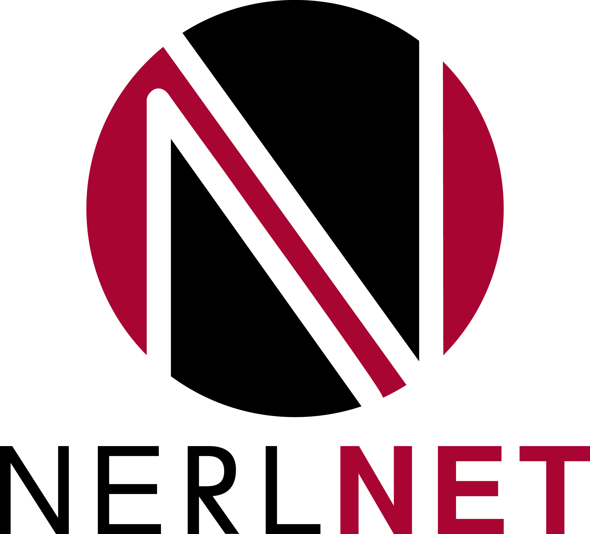

[](https://discord.gg/xwBTbzER)  
[](https://www.linkedin.com/company/nerlnet)
[](https://www.youtube.com/channel/UCnnWPPKiHioTBy7Zq5shrQw)


# NErlNet

<p align="center">
  
</p>

Nerlnet is an open-source library for researching distributed machine learning algorithms on IoT devices. It provides comprehensive insights into both edge devices that run neural network models and network performance and statistics. Nerlnet can simulate distributed ML clusters on a single or multiple machines and deploy these clusters, with minor changes, on various kinds of IoT devices.  

Nerlnet simplifies the setup of a distributed cluster that consists of many models on its edge, communication flow can be fully controlled and monitored, and Nerlnet's Python API allows users to manage and gather data from the distributed cluster throughout the experiment.  

Nerlnet library combines the following languages to achieve a stable and efficient distributed ML system framework:  
• The communication layer of Nerlnet is based on an Cowboy - an HTTP web server open-source library.  
• ML on the edge of the distributed cluster is based on OpenNN library, an open-source project of Cpp Neural Network library.  
• Managemnt of Nerlnet cluster - An HTTP server of Flask communicates with Nerlnet's main server to control the cluster's entities.  

 
 
 

 
### Nerlnet cluster is defined by three configuration files (Json files):
- Distributed Configuration that defines entities of Nerlnet: Source, Router, Client.
  - A client is a host of workers. A worker is a NN model that can move between phases of train and predict.
  - Source generates data streams that are sent to workers.
  - Router controls the data flow through Nerlnet cluster.

### References and libraries:
- [OpenNN](https://www.opennn.net/), an open-source neural networks library for machine learning.   
- [Cowboy](https://github.com/ninenines/cowboy) an HTTP server for Erlang/OTP.  
- [NIFPP](https://github.com/goertzenator/nifpp) C++11 Wrapper for Erlang NIF API.   
- [Rebar3](https://github.com/erlang/rebar3), an Erlang tool that makes it easy to create, develop, and release Erlang libraries, applications, and systems in a repeatable manner.
- [Simple Cpp Logger](https://github.com/nadrino/simple-cpp-logger), simple cpp logger headers-only implementation.

Nerlnet is developed by David Leon, Dr. Yehuda Ben-Shimol, and the community of Nerlnet open-source contributors.  

### Nerlnet Architecture Example:


# Build and Run Nerlnet:
Recommended cmake version 3.26   
Minimum erlang version otp 25 (Tested 24,25,26)   
Minimum gcc/g++ version 10.3.0   

On every device that is a part of Nerlnet cluster the following steps should be taken:

1. Clone this repository with its subomdules ```git clone --recurse-submodules <link to this repo> NErlNet```  
2. Run ```sudo ./NerlnetInstall.sh```  
  2.1 With argument -i script builds and installs Erlang, latest stable, and CMake.
      (validate that erlang is not installed before executing installation from source)
  2.2 On successful installation, NErlNet directory is accessible  
      via the following path: ```/usr/local/lib/nerlnet-lib```
3. Run ```./NerlnetBuild.sh```
4. Test Nerlnet by running: ```./tests/NerlnetFullFlowTest.sh```
5. [Nerlplanner](https://github.com/leondavi/NErlNet/tree/master/src_py/nerlPlanner) is a Nerlnet tool to generate required jsons files to setup a distributed system of Nerlnet.  
To use NerlPlanner execute ```./NerlPlanner.sh``` (support starts from version 1.3.0).  
Create json files of distributed configurations, connection map and experiment flow as follows:  
- dc_\<any name\>.json  
- conn_\<any name\>.json  
- exp_\<any name\>.json       
6. Run ```./NerlnetRun.sh``` to start Nerlnet.
7. Start Jupyter NB with ```./NerlnetJupyterLaunch.sh``` and follow ApiServerInstance.help() and [examples](https://github.com/leondavi/NErlNet/tree/master/examples).

## Python API and Jupyter-lab (For Api-Server): 
Minimum Python version: 3.8  
  
Communication with Nerlnet is done through a simple python API that can be easily used through Jupyter notebook.       
The API allows the user to collect statistics insights of a distributed machine learning network:   
Number of messages, throughput, loss, predictions, models performance, etc.  

### Instructions
1. Open a jupyter lab environment using ```./NerlnetJupyterLaunch.sh -d <experiment_direcotry>```  
1.1    Use -h to see the help menu of NerlnetJupyterLaunch.sh script.  
1.2    If --no-venv option is selected then required modules can be read from ```src_py/requirements.txt```.  
3. Read the instructions of importing Api-Server within the generated readme.md file inside <experiment_directory> folder. 
4. Follow the example: https://github.com/leondavi/NErlNet/blob/master/examples/example_run.ipynb 

Visit our hugging face organization page for more datasets and models of Nerlnet.  
[](https://huggingface.co/Nerlnet)
### Social
Distributed ML on the edge - A new evolution step of AI.  

https://github.com/leondavi/NErlNet/assets/18975070/15a3957a-3fd6-4fb2-a365-7e1578468298  
  
[](https://www.linkedin.com/company/nerlnet)  


## Gratitudes
<h3 align="center">Microsoft Azure</h1>
<p align="center"> </p>  
<p align="center"> A grant of Azure credits as part of Microsoft’s Azure credits for open source projects program (2024).</p>  
<h3 align="center">Amazon AWS</h1>
<p align="center"> </p>  

<p align="center"> A grant of AWS credits as part of AWSOpen program for open source projects (2024).</p>
